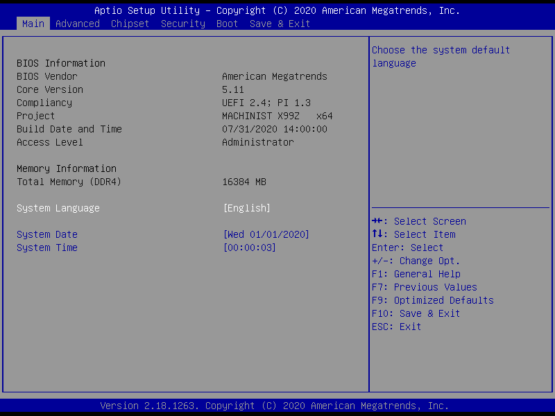
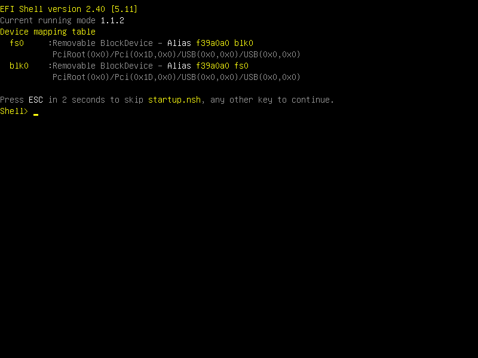

# MACHINIST X99Z V102
### <a target="_blank" rel="noopener noreferrer" href="https://machinist.de.aliexpress.com/store/3666028">Sponsored by (AliExpress) MACHINIST Store</a>
* #### Running X99Z-V102 / Kllisre X99Z-V102 / ALZENIT X99M-CE5, X99-PE7(X99 V1.2) / XLZ X99Z-V102
* ##### Release C612RD25R 09/25/2020
    
    
    
* ##### First stable version C612RD25 07/31/2020
    
    

## C612RD23 BIOS for MACHINIST X99Z V102 Motherboard
  

  
  Builder: iEngineer
  
  Manufacturer Bug Fixed, Latest updates, set FSB 100MHz
  
  Update:
1) ME Firmware (last serviceable) version 9.1.37.1002 (1,5MiB).
2) EFI/OROM for RSTe SATA(Port 0-3) firmware up to 5.5.5.1005 ((latest) Full I/O speed).
3) CPU microcode (latest).

  Changes:
1) Enable DUAL/QUAD SPI for Winbond 25Q128FVSG & 25Q128JVSQ.
2) Changes Master Acces from Debug/Manufacturing to Production.
3) Increased BBBS up to 1MiB.
4) Hidden BIOS items that do not control.

  How to update Firmware:
1) Burn the Firmware to programmer device. (e.g. EZP-2019)
2) Clear CMOS.
3) After restart go to the BIOS setting & use 'Restore Default' / 'F10' / 'Enter'
4) Configure RAM timings & enjoy.
  

Addon: 7BB28B99-61BB-11D5-9A5D-0090273FC14D.FFS

  How to install addon:
1) Open BIOS file in UEFITool
2) Find (Ctrl+F) GUID 7BB28B99-61BB-11D5-9A5D-0090273FC14D then select (Ctrl+R) Replace as is (choise new downloaded  7BB28B99-61BB-11D5-9A5D-0090273FC14D.FFS file).
3) File (Ctrl+S) Save image file.

* #### tRFC Table

